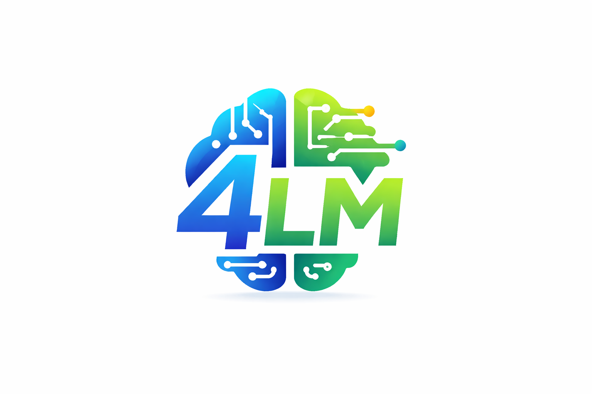

# llllm



Lightweight Local & Large Language Model Wrapper.

The four Ls in `LLLLM` refer to:

- Local models, mainly via Ollama
- Large language models from Claude
- Large language models from Gemini
- Large language models from OpenAI

`llllm` is a minimal Python package that provides one sync interface for:

- OpenAI via the Responses API
- Anthropic Claude via the Messages API
- Google Gemini via the Generative Language API
- Ollama via the local generate API

## Install

```bash
pip install -e .
```

## Step-by-Step Setup

If you are starting a new Python project or already have an existing one and want to import `llllm`, follow these steps.

### 1. Clone The `llllm` Repository

```bash
git clone git@github.com:CodesInTheShell/llllm.git
cd llllm
```

This gives you a local copy of the library that you can install into your own project.

### 2. Create Or Open Your Own Project

If you are starting a new project:

```bash
mkdir my_project
cd my_project
```

If you already have an existing project:

```bash
cd /path/to/your-project
```

### 3. Create A Virtual Environment

Using Python `venv`:

```bash
python3 -m venv .venv
source .venv/bin/activate
```

Or using `uv`:

```bash
uv venv
source .venv/bin/activate
```

Using a virtual environment is recommended so your project dependencies, including `llllm`, stay isolated from your global Python installation.

### 4. Install `llllm` Into Your Project

Install directly from the local clone:

```bash
pip install -e /path/to/llllm
```

If your clone is at `~/llllm`, that would be:

```bash
pip install -e ~/llllm
```

If you are using `uv`, the equivalent is:

```bash
uv pip install -e /path/to/llllm
```

Editable mode is useful because if `llllm` changes locally, your project will pick up those changes without a reinstall.

### 5. Set Environment Variables For Cloud Providers

OpenAI:

```bash
export OPENAI_API_KEY=your_openai_key
```

Claude:

```bash
export ANTHROPIC_API_KEY=your_anthropic_key
```

Gemini:

```bash
export GEMINI_API_KEY=your_gemini_key
```

For local usage with Ollama, no API key is required. Ollama should be running on `http://localhost:11434`.

### 6. Import `llllm` In Your Project Code

```python
from llllm import LLLLM
```

### 7. Create A Client

Ollama:

```python
client = LLLLM("ollama:llama3")
```

OpenAI:

```python
client = LLLLM("openai:gpt-4.1")
```

Claude:

```python
client = LLLLM("claude:claude-3-7-sonnet")
```

Gemini:

```python
client = LLLLM("gemini:gemini-1.5-pro")
```

### 8. Generate Text

```python
response = client.gen("Explain OSINT in simple terms")
print(response["llllm_response"]["text"])
```

You can also use structured role-based input with OpenAI, Claude, and Gemini:

```python
response = client.gen(
    [
        {"role": "system", "content": "You are an OSINT analyst."},
        {"role": "user", "content": "Explain OSINT in simple terms."},
    ]
)
print(response["llllm_response"]["text"])
```

Ollama now supports text and image parts. Non-image file parts are still rejected.

You can also send image or file parts:

```python
response = client.gen(
    [
        {
            "role": "user",
            "content": [
                {"type": "text", "text": "Describe this image"},
                {"type": "image", "path": "./image.png"},
            ],
        }
    ]
)
```

```python
response = client.gen(
    [
        {
            "role": "user",
            "content": [
                {"type": "text", "text": "Summarize this PDF"},
                {"type": "file", "path": "./report.pdf"},
            ],
        }
    ]
)
```

### 9. Full Example In Your Project

```python
from llllm import LLLLM

client = LLLLM("ollama:llama3")
response = client.gen(
    "Summarize cyber threat intelligence",
    temperature=0.7,
    max_tokens=300,
)

print(response["llllm_response"]["text"])
```

### 10. What This Means In Practice

After installation, `llllm` behaves like any normal Python dependency in your project:

```python
from llllm import LLLLM
```

You do not need to copy files from this repository into your own project. You only need to install the package and import it.

## Usage

```python
from llllm import LLLLM

client = LLLLM("ollama:llama3")
response = client.gen(
    "Summarize cyber threat intelligence",
    temperature=0.7,
    max_tokens=300,
)

print(response["llllm_response"]["text"])
```

Example using base64 for an image:

```python
import base64

from llllm import LLLLM

with open("image.png", "rb") as f:
    image_b64 = base64.b64encode(f.read()).decode("ascii")

client = LLLLM("openai:gpt-4.1")
response = client.gen(
    [
        {
            "role": "user",
            "content": [
                {"type": "text", "text": "Describe this image"},
                {
                    "type": "image",
                    "mime_type": "image/png",
                    "data": image_b64,
                },
            ],
        }
    ]
)

print(response["llllm_response"]["text"])
```

Example using base64 for a file:

```python
import base64

from llllm import LLLLM

with open("report.pdf", "rb") as f:
    file_b64 = base64.b64encode(f.read()).decode("ascii")

client = LLLLM("gemini:gemini-1.5-pro")
response = client.gen(
    [
        {
            "role": "user",
            "content": [
                {"type": "text", "text": "Summarize this PDF"},
                {
                    "type": "file",
                    "mime_type": "application/pdf",
                    "filename": "report.pdf",
                    "data": file_b64,
                },
            ],
        }
    ]
)

print(response["llllm_response"]["text"])
```

Cloud providers can use explicit keys:

```python
client = LLLLM("openai:gpt-4.1", api_key="your_key")
```

Or environment variables:

```bash
export OPENAI_API_KEY=...
export ANTHROPIC_API_KEY=...
export GEMINI_API_KEY=...
```

`client.gen(...)` accepts:

- A simple string prompt for all providers
- A role-based message dictionary for OpenAI, Claude, and Gemini
- A list of role-based message dictionaries for OpenAI, Claude, and Gemini
- Content parts inside structured messages, including text, image, and file blocks

Examples:

```python
client.gen("Explain OSINT in simple terms")
```

```python
client.gen({"role": "user", "content": "Explain OSINT in simple terms"})
```

```python
client.gen(
    [
        {"role": "system", "content": "You are an analyst."},
        {"role": "user", "content": "Explain OSINT in simple terms"},
    ]
)
```

```python
client.gen(
    [
        {
            "role": "user",
            "content": [
                {"type": "text", "text": "Describe this image"},
                {"type": "image", "path": "./image.png"},
            ],
        }
    ]
)
```

```python
client.gen(
    [
        {
            "role": "user",
            "content": [
                {"type": "text", "text": "Summarize this file"},
                {"type": "file", "path": "./report.pdf"},
            ],
        }
    ]
)
```

Supported content part keys:

- Text: `{"type": "text", "text": "..."}`
- Image: `{"type": "image", "path": "..."}`
- Image: `{"type": "image", "mime_type": "image/png", "data": "<base64>"}`
- File: `{"type": "file", "path": "..."}`
- File: `{"type": "file", "mime_type": "application/pdf", "data": "<base64>", "filename": "report.pdf"}`

Provider notes:

- OpenAI supports text, image, and file parts
- Claude supports text, image, and document/file parts
- Gemini supports text, image, and file parts
- Ollama supports text and image parts; non-image file parts are rejected

## Response Format

```python
{
    "raw_response": {...},
    "llllm_response": {
        "text": "...",
        "provider": "...",
        "model": "...",
        "usage": {
            "input_tokens": int | None,
            "output_tokens": int | None,
            "total_tokens": int | None,
        },
        "finish_reason": str | None,
    },
}
```
